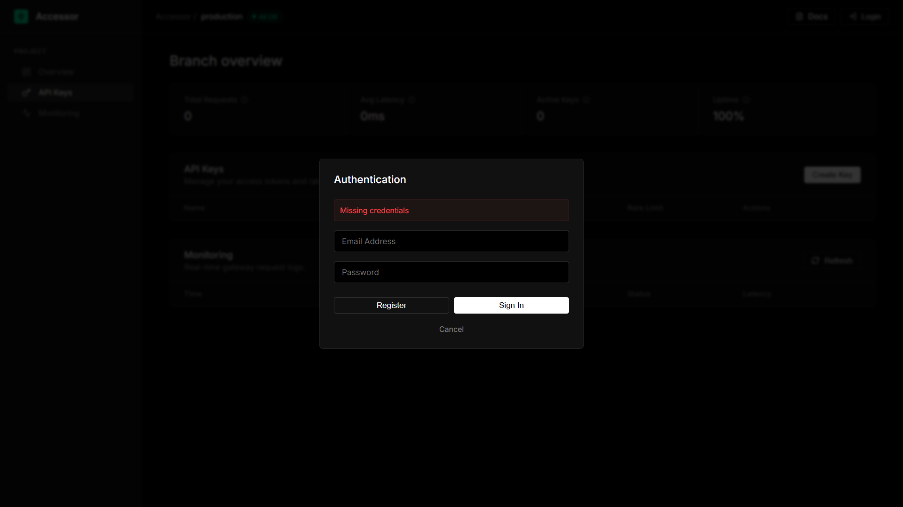
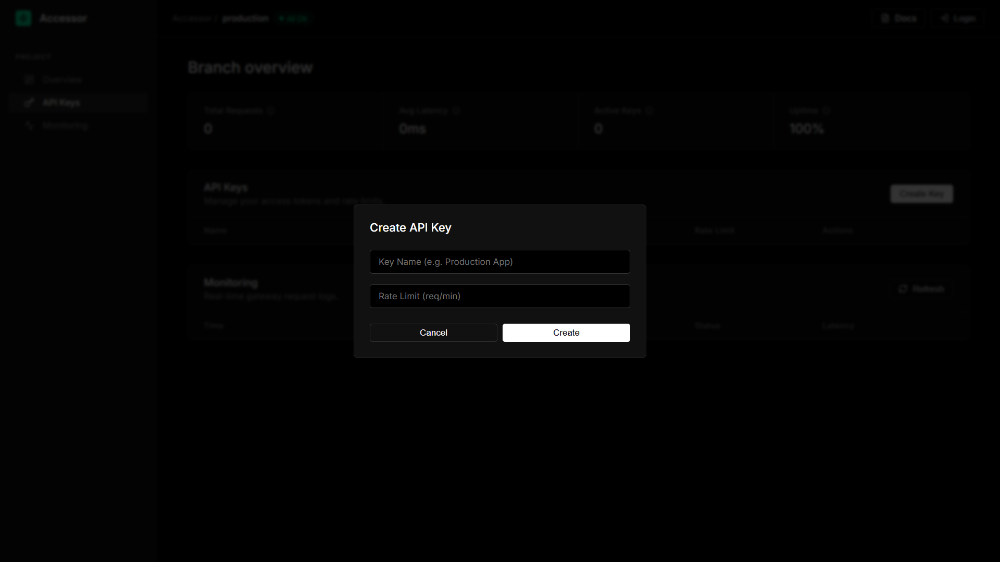
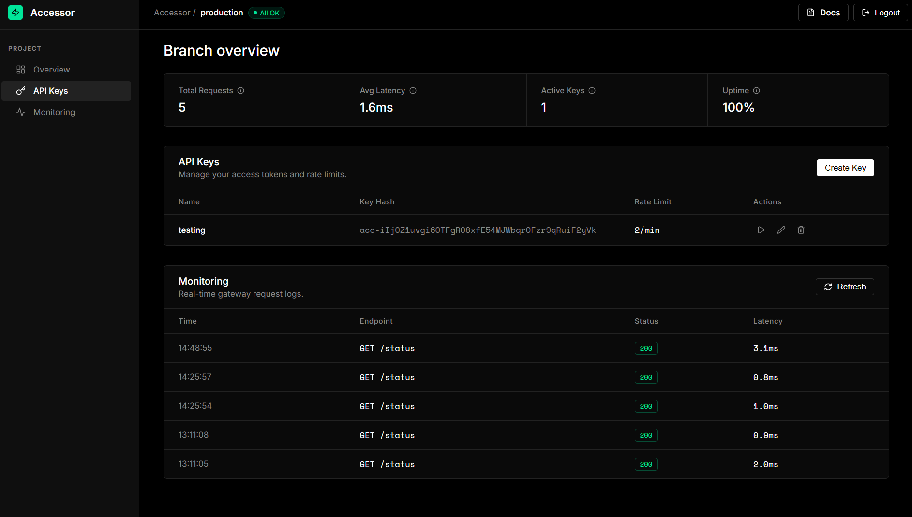

# Accessor

---

Accessor is a production-ready **API Key Management and Usage Tracking System** built with FastAPI and PostgreSQL. Designed to mirror real-world SaaS infrastructure, it enables user registration, API key generation (`acc-...` prefix), and secure request authentication via JWT.

---

Every API request is tracked in real time — including endpoint, response time, status code, and timestamp — through a custom middleware layer. Accessor serves as a clean, interview-ready demonstration of production-grade API architecture.

---

## Features

- **Developer Console**  
  Custom frontend (HTML, CSS, Vanilla JS) with a modern dark UI, full-width tables, and minimal design. Served via FastAPI.

- **User Authentication**  
  JWT-based authentication with bcrypt password hashing.

- **API Key Management**  
  Secure key generation with custom prefixes (`acc-...`). Supports creation, listing, and revocation.

- **Usage Tracking**  
  Middleware logs all API activity in real time.

- **Analytics API**  
  Aggregated usage stats per key including request count, success rate, and response time.

- **API Documentation**  
  Auto-generated Swagger and ReDoc interfaces.

---

## Screenshots

### Authentication


### Create API Key


### Dashboard


---

## Tech Stack

| Layer | Technology |
|---|---|
| Backend | FastAPI |
| Frontend | HTML, CSS, Vanilla JS |
| Database | PostgreSQL (Neon) |
| ORM | SQLModel, SQLAlchemy |
| Auth | python-jose (JWT), bcrypt |
| Config | pydantic-settings |

---

## Directory Structure

```text
Accessor/
├── app/
│   ├── analytics/
│   ├── auth/
│   ├── keys/
│   ├── middleware/
│   ├── static/
│   ├── core.py
│   ├── database.py
│   ├── deps.py
│   ├── main.py
│   ├── models.py
│   └── schemas.py
├── docs/                  # Screenshots and documentation assets
├── scratch/
├── .env
├── requirements.txt
└── README.md
```

---

## Local Setup

1. Clone the repository

2. Start Redis using Docker Compose:
```bash
docker-compose up -d
```

3. Create a virtual environment:
```bash
python -m venv venv
source venv/bin/activate  # Windows: venv\Scripts\activate
```

4. Install dependencies:
```bash
pip install -r requirements.txt
```

5. Configure environment variables:
```bash
cp .env.example .env
```

Update `.env` with:
- DATABASE_URL
- REDIS_URL
- SECRET_KEY
- ALGORITHM=HS256
- ACCESS_TOKEN_EXPIRE_MINUTES=30

6. Run the server:
```bash
uvicorn app.main:app --reload
```

Server runs at:
- http://127.0.0.1:8000/

---

## API Access

- Dashboard: http://127.0.0.1:8000/  
- Swagger Docs: http://127.0.0.1:8000/docs  
- ReDoc: http://127.0.0.1:8000/redoc  

---

## Deployment

Recommended stack:

- Database: Neon (PostgreSQL)
- Cache: Upstash (Redis)
- Hosting: Render (Web Service)

---

## Contributing

Pull requests are welcome. For major changes, please open an issue first to discuss what you would like to change.

---

## License

MIT License

